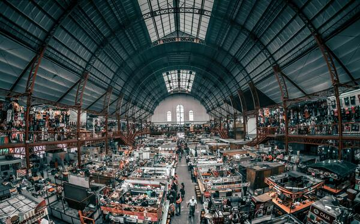

# Vendedores y centros de distribución

## Antes de empezar: algunos consejos

El enunciado tiene **mucha** información, van a necesitar leerlo varias veces. La sugerencia es que lo lean entero una vez (para tener una idea general) y luego vuelvan a consultarlo las veces que hagan falta.

Concentrensé en los requerimientos y, excepto que se traben mucho, respeten el orden sugerido. Sería interesante que vayan creando las distintas clases y métodos a medida que resuelven cada requerimiento y no antes.

En otras palabras: trabajen completando cada requerimiento antes de pasar al siguiente, con los tests que aseguran que funciona incluidos. Si al avanzar en los requerimientos les parece necesario refactorizar, adelante, van a tener los tests que garantizan que no rompieron nada. :smirk:

## Descripción del dominio

López y López es una empresa de distribución de productos de consumo masivo, que se distribuyen en ciudades repartidas por toda la geografía nacional.

Su organización está basada en **centros de distribución**. Cada centro trabaja con distintos **vendedores**.

Se nos pide desarrollar un modelo de los centros, los vendedores, y la relación entre ellos.

### Vendedores

López y López recluta vendedores de tres tipos:

- **Vendedor fijo**: se sabe en qué ciudad vive.
- **Viajante**: cada viajante está habilitado para trabajar en algunas provincias, se sabe cuáles son.
- **Comercio corresponsal**: son comercios que tienen sucursales en distintas ciudades. Se sabe, para cada comercio corresponsal, en qué ciudades tiene sucursales.

De cada ciudad debemos registrar en qué provincia está, y de cada provincia, su población.

De cada vendedor, se tiene detalle de las **certificaciones** que posee.
Cada certificación otorga una cantidad de _puntos_. Algunas certificaciones son sobre productos, otras no.

### Vendedor influyente

Para la empresa, es importante saber si un vendedor _es influyente_. La condición para que lo sea depende del tipo de vendedor:

- _vendedor fijo_: ningún vendedor fijo es influyente.
- _viajante_: la población total sumando todas las provincias donde está habilitado, debe ser de 10 millones o superior.
- _comercio corresponsal_: debe tener sucursales en al menos 5 ciudades, o bien en al menos 3 provincias considerando la provincia de cada ciudad donde tiene sucursal.

P.ej. un comercio corresponsal que tenga sucursales en

- Chivilcoy, Bragado, Lobos, Pergamino y Zárate: es influyente, se cumple la condición de 5 ciudades.
- Rosario (Santa Fe), Rafaela (Santa Fe), San Francisco (Córdoba), y Diamante (Entre Ríos): es infuyente, se cumple la condición de 3 provincias.
- Rosario, Rafaela, Amstrong (Santa Fe) y Diamante: no es influyente, son 4 ciudades y 2 provincias, no cumple ninguna de las condiciones.

### Centros de distribución

En nuestro modelo también tenemos los **centros de distribución**, de cada uno se sabe en qué ciudad está, y con qué vendedores trabaja.

Debe poder _agregarse_ un vendedor a un centro. Si el vendedor ya está registrado para el centro, debe generarse un error.

## Requerimientos

### Etapa 1

Desarrollar un modelo de vendedores que permita consultar:

1. Dada una ciudad, si un vendedor _puede trabajar_ en esa ciudad. La condición depende del tipo de vendedor, como se indica a continuación:
   - _vendedor fijo_: debe ser la ciudad en la que vive.
   - _viajante_: la ciudad debe estar en una provincia en la que está habilitado.
   - _comercio corresponsal_: debe ser una ciudad en la que tiene sucursal.
1. Si un vendedor _es versátil_. Las condiciones son: que tenga al menos tres certificaciones, que tenga al menos una sobre productos, y al menos una que no sea sobre productos.
1. Si un vendedor _es firme_. La condición es que el puntaje total que le otorgan sus certificaciones sea mayor o igual a 30.

### Etapa 2

Saber si un vendedor es o no influyente.

### Etapa 3

Debe poder consultarse, para un centro de distribución:

1. El _vendedor estrella_, que es el que tiene mayor puntaje total por certificaciones.
1. Si _puede cubrir_, o no, una ciudad dada. La condición es que al menos uno de los vendedores registrados pueda trabajar en esa ciudad.
1. La colección de _vendedores genéricos_ registrados. Un vendedor se considera genérico si tiene al menos una certificación que no es de productos.
1. Si _es robusto_, la condición es que al menos 3 de sus vendedores registrados sea firme.

## Licencia

Esta obra fue elaborada por [Federico Aloi](https://github.com/faloi) y publicada bajo una [Licencia Creative Commons Atribución-CompartirIgual 4.0 Internacional][cc-by-sa].

[![CC BY-SA 4.0][cc-by-sa-image]][cc-by-sa]

[cc-by-sa]: https://creativecommons.org/licenses/by-sa/4.0/deed.es
[cc-by-sa-image]: https://licensebuttons.net/l/by-sa/4.0/88x31.png

### Créditos

:memo: [Enunciado original](https://github.com/obj1-unahur/vendedores_2019s2) creado por [Carlos Lombardi](https://github.com/clombardi).

:camera_flash: Imagen de portada por <a href="https://unsplash.com/@jezael?utm_source=unsplash&utm_medium=referral&utm_content=creditCopyText">Jezael Melgoza</a> en <a href="https://unsplash.com/s/photos/market?utm_source=unsplash&utm_medium=referral&utm_content=creditCopyText">Unsplash</a>.
